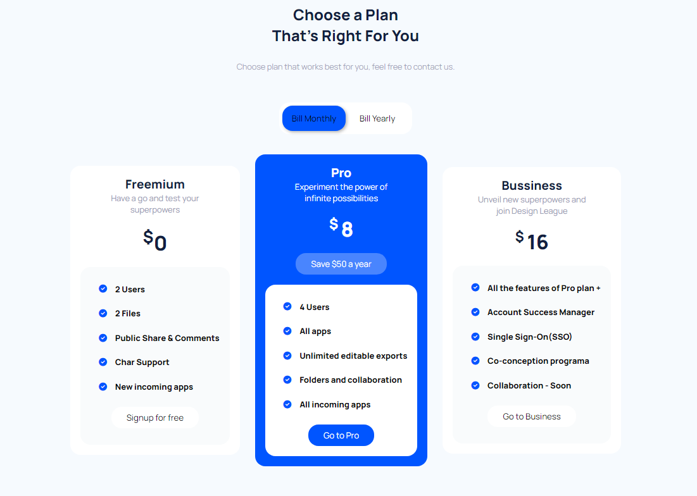

VER: https://fabrizio951.github.io/semana2/index.html

Descripción del Proyecto:

Este proyecto consiste en la creación de una página web que muestra diferentes planes de suscripción para un servicio. Se pueden seleccionar entre tres opciones de planes (Freemium, Pro y Business) y obtener información detallada sobre cada uno de ellos.

1. Estructura del Código:

El proyecto consta de un archivo HTML y un archivo CSS.

2. Crear archivo HTML:

Una etiqueta (head) que incluye la configuración del metadato de codificación de caracteres y enlaces a archivos externos.

El cuerpo de la página (body) contiene un contenedor principal (main) que engloba todo el contenido de la página.

Dentro del contenedor principal, se encuentra un 
 con la clase "contenedor" que agrupa todos los elementos del formulario de suscripción.
  
Los elementos del formulario de suscripción incluyen:
  
Un encabezado (h1) con la clase "title" que muestra el título "Choose a Plan That's Right For You".
  
Un párrafo (p) con la clase "parrafo" que proporciona una breve descripción del propósito del formulario.
  
Un conjunto de botones de selección ("Bill Monthly" y "Bill Yearly") con las clases "btn-mov" y los identificadores "btn-a" y "btn-b", respectivamente.
  
Una sección de planes ((div) con la clase "Planes-grupo") que contiene tres planes diferentes (Freemium, Pro y Business).
  
Cada plan tiene un título (h2) con las clases "plan-titulo-lado" (para el plan Freemium) y "plan-titulo-medio" (para los planes Pro y Business), un párrafo de descripción (p) con las clases "plan-texto" (para el plan Freemium) y "plan-texto-medio" (para los planes Pro y Business), y detalles del plan, incluyendo el precio (p) con las clases "precio" y "plan-precio" (para el plan Freemium y Business) y "plan-precio-medio" (para el plan Pro).
  
Además, cada plan tiene una lista de características (ul) con la clase "item" y elementos de lista (li) que incluyen iconos (i) y descripciones de características.
Cada plan también tiene un botón para realizar la acción correspondiente ("Signup for free" para el plan Freemium, "Save $50 a year" para el plan Pro y "Go to Business" para el plan Business).

3. Crear arhivo CSS:
  
Importación de la fuente de Google Fonts "Manrope".
  
Establecimiento de estilos generales para el cuerpo de la página, como el fondo (background), el margen (margin), el relleno (padding) y la fuente (font-family).
De los cambios principales para el diseño esta:
  
El contenedor principal con la clase "contenedor", incluyendo la alineación (display, flex-direction, align-items, justify-content), el tamaño máximo de altura (max-height) y el relleno (padding).
  
El título con la clase "title", incluyendo la alineación del texto (text-align), el tamaño de fuente (font-size), el peso de la fuente (font-weight) y el color del texto (color).
  
El botón deslizante (btn-slide), incluyendo el fondo (background-color), el tamaño (width, height), el radio de borde (border-radius), la posición (position, top, left), el z-index y la transición de posición (transition).
  
La sección de planes con la clase "Planes-grupo", incluyendo la alineación (display, align-items, margin-top) y el espacio entre elementos (gap).
  
Los planes laterales con la clase "plan-lado", incluyendo la alineación del texto (text-align), el fondo (background-color), el radio de borde (border-radius), el relleno (padding) y la altura (height).
  
El título de los planes laterales con la clase "plan-titulo-lado", incluyendo el color del texto (color), el tamaño de fuente (font-size) y el peso de la fuente (font-weight).
  
El texto de los planes laterales con la clase "plan-texto", incluyendo el color del texto (color) y el tamaño de fuente (font-size).
  
El plan medio con la clase "plan-medio", incluyendo el fondo (background-color), el radio de borde (border-radius), la alineación del texto (text-align) y el relleno (padding).
  
Estos son solo algunos de los estilos presentes en el archivo CSS. Hay otros estilos definidos en el código que contribuyen al diseño visual de la página.
